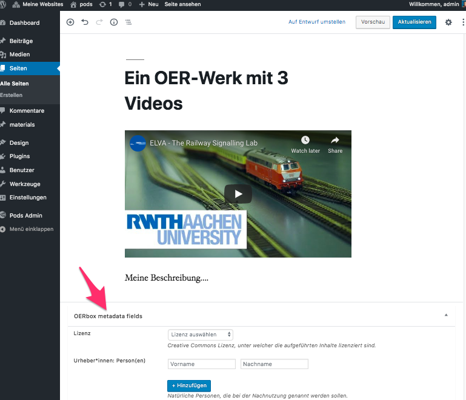
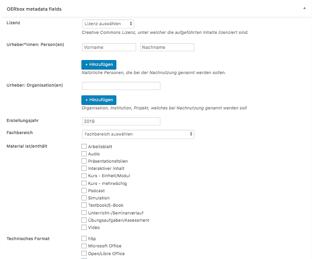

Beware: Work in progress

# OERbox for wordpress
Experimental wordpress plugin - add custom fields for OER metadata for regular posts and pages via https://metabox.io, fields will be added to HTML head in schema.org format (machine readable information)

1. Install wordpress
2. Install and activate https://wordpress.org/plugins/meta-box/
3. Copy this repo to /wp-content/plugins/
4. Install und activate oerbox-Plugin
5. Create new page/post, metadata-box is below page/post content

Goals:
- :heavy_check_mark: add license URL to "link rel="license""-tag in HTML head
- :o: Add schema.org LD-JSON to HTML head in a compliant way (see source code of https://www.oerbw.de/edu-sharing/components/render/eb6f6159-021e-4985-8aaa-4d8a36e9b6a2)

Projects I have in mind creating this:
- https://oer.uni-leipzig.de
- https://bridge.nrw/index.php/betriebswirtschaftslehre/

Inspired by https://oervz.openbiblio.eu/ and http://blog.lobid.org/2019/05/17/skohub.html
